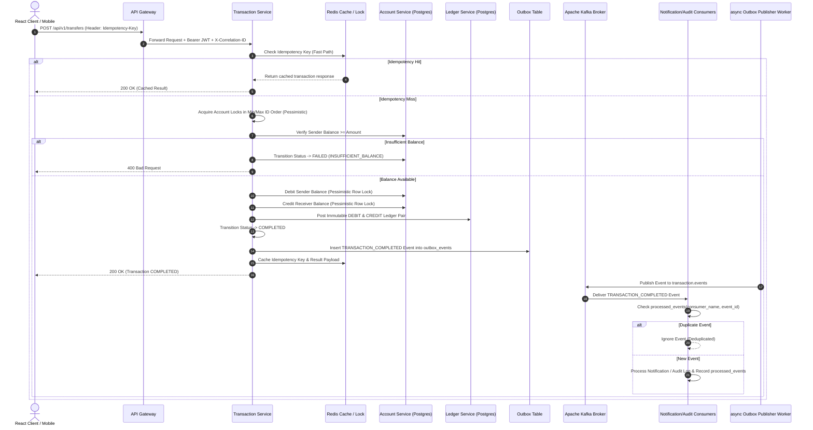
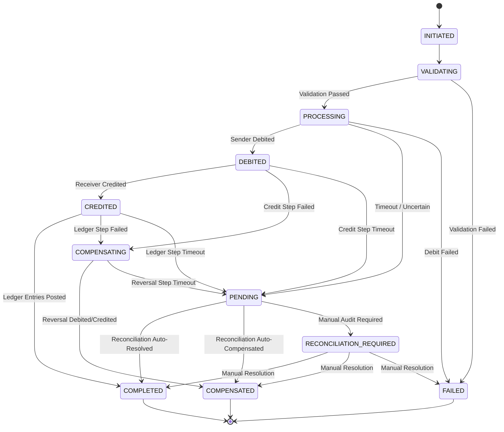

# Transaction Lifecycle & Execution Flow — Atomic-Pay

## 1. Complete Transfer Sequence Diagram

```mermaid
sequenceDiagram
    autonumber
    actor Client as React Client / Mobile
    participant Gateway as API Gateway
    participant TxService as Transaction Service
    participant Redis as Redis Cache / Lock
    participant AccountService as Account Service (Postgres)
    participant LedgerService as Ledger Service (Postgres)
    participant Outbox as Outbox Table
    participant Kafka as Apache Kafka Broker
    participant Consumer as Notification/Audit Consumers

    Client->>Gateway: POST /api/v1/transfers (Header: Idempotency-Key)
    Gateway->>TxService: Forward Request + Bearer JWT + X-Correlation-ID
    
    TxService->>Redis: Check Idempotency Key (Fast Path)
    alt Idempotency Hit
        Redis-->>TxService: Return cached transaction response
        TxService-->>Client: 200 OK (Cached Result)
    else Idempotency Miss
        TxService->>TxService: Acquire Account Locks in Min/Max ID Order (Pessimistic)
        TxService->>AccountService: Verify Sender Balance >= Amount
        alt Insufficient Balance
            TxService->>AccountService: Transition Status -> FAILED (INSUFFICIENT_BALANCE)
            TxService-->>Client: 400 Bad Request
        else Balance Available
            TxService->>AccountService: Debit Sender Balance (Pessimistic Row Lock)
            TxService->>AccountService: Credit Receiver Balance (Pessimistic Row Lock)
            TxService->>LedgerService: Post Immutable DEBIT & CREDIT Ledger Pair
            TxService->>TxService: Transition Status -> COMPLETED
            TxService->>Outbox: Insert TRANSACTION_COMPLETED Event into outbox_events
            TxService->>Redis: Cache Idempotency Key & Result Payload
            TxService-->>Client: 200 OK (Transaction COMPLETED)
            
            async Outbox Publisher Worker->>Kafka: Publish Event to transaction.events
            Kafka->>Consumer: Deliver TRANSACTION_COMPLETED Event
            Consumer->>Consumer: Check processed_events(consumer_name, event_id)
            alt Duplicate Event
                Consumer-->>Consumer: Ignore Event (Deduplicated)
            else New Event
                Consumer->>Consumer: Process Notification / Audit Log & Record processed_events
            end
        end
    end
```

---

## 2. Transaction State Machine & Transitions

```mermaid
stateDiagram-v2
    [*] --> INITIATED
    INITIATED --> VALIDATING
    
    VALIDATING --> PROCESSING : Validation Passed
    VALIDATING --> FAILED : Validation Failed
    
    PROCESSING --> DEBITED : Sender Debited
    PROCESSING --> PENDING : Timeout / Uncertain
    PROCESSING --> FAILED : Debit Failed
    
    DEBITED --> CREDITED : Receiver Credited
    DEBITED --> COMPENSATING : Credit Step Failed
    DEBITED --> PENDING : Credit Step Timeout
    
    CREDITED --> COMPLETED : Ledger Entries Posted
    CREDITED --> COMPENSATING : Ledger Step Failed
    CREDITED --> PENDING : Ledger Step Timeout
    
    COMPENSATING --> COMPENSATED : Reversal Debited/Credited
    COMPENSATING --> PENDING : Reversal Step Timeout
    
    PENDING --> COMPLETED : Reconciliation Auto-Resolved
    PENDING --> COMPENSATED : Reconciliation Auto-Compensated
    PENDING --> RECONCILIATION_REQUIRED : Manual Audit Required
    
    RECONCILIATION_REQUIRED --> COMPLETED : Manual Resolution
    RECONCILIATION_REQUIRED --> COMPENSATED : Manual Resolution
    RECONCILIATION_REQUIRED --> FAILED : Manual Resolution
    
    COMPLETED --> [*]
    COMPENSATED --> [*]
    FAILED --> [*]
```
